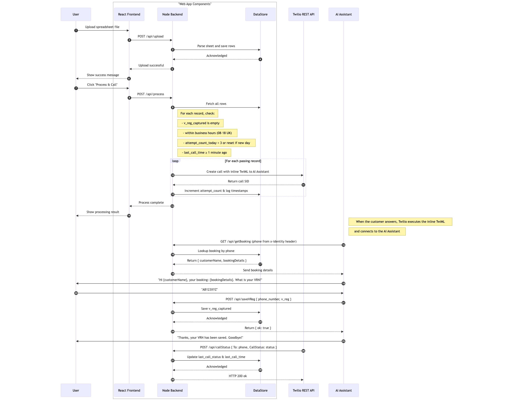

# Twilio – AI Assistant VRN Collector

> **Disclaimer:**  
> This is a proof-of-concept, non-official Twilio application. It is **not production-ready** or supported by Twilio. Use it at your own risk, and apply your own security, error-handling, and production best practices before deploying anywhere critical.

A small Node.js + React web application that helps Holiday Extras collect missing vehicle registration numbers (VRNs) from customers via automated outbound calls.  
If a customer booked airport parking without supplying their car’s registration, this app:

1. Parses an uploaded spreadsheet of bookings.
2. Filters out any row where the VRN is already present.
3. Checks “UK business hours” (08:00–18:00) and “max 3 call attempts per customer per day” with a 1-minute backoff.
4. Uses the Twilio Voice API to place an outbound call that connects directly to a Twilio AI Assistant (via inline TwiML).
5. Exposes two AI-assistant tools:
   - **GetBooking** → returns `{ customerName, bookingDetails }` for a given phone number (from `X-Identity` header).
   - **SaveVReg** → accepts `{ phone, vReg }` (or reads `X-Identity`) and writes the captured VRN back into the data store.
6. Provides a React UI for:
   - Uploading a spreadsheet (XLSX or CSV).
   - Clicking “Process & Call” to queue outbound calls.
   - Viewing live call-status and editing any fields inline.
   - Downloading the current data as CSV.

---




## ⚙️ Features

- **One-click upload** of any Excel/CSV with arbitrary column headers: the backend will detect “Phone,” “Booking ID,” “Customer Name,” “Booking Details,” etc., normalize each row, and save it.
- **Automated outbound calls** via the Twilio Voice API, using inline `<Connect><Assistant>` TwiML.
- **AI Assistant integration** for collecting VRNs:
  - `/api/getBooking` → AI tool fetches customer name & booking description.
  - `/api/saveVReg` → AI tool submits the collected VRN.
- **Business-logic safeguards**:
  - Only calls between 08:00–18:00 UK time.
  - Maximum of 3 call attempts per phone number per day.
  - A 1-minute retry backoff if “busy” or “no-answer.”
- **React frontend** to:
  - Upload and parse spreadsheets.
  - Manually trigger “Process & Call.”
  - View/edit all rows in a live table (with inline cell editing → `PATCH /api/updateRecord/:bookingId`).
  - Download the current data as CSV (`GET /api/download`).

---

## 📦 Prerequisites

- **Node.js ≥ 14.x** (we recommend ≥ 16.x)
- **npm** (bundled with Node)
- A free **ngrok** account (for exposing your local server to Twilio)
- A Twilio account with a Voice-capable phone number and an AI Assistant SID

---

## 🚀 Installation & Setup

Below steps assume you’re cloning into a fresh directory on your machine.

### 1. Clone the repository

```bash
git clone https://github.com/<your-github-username>/twilio-vrn-collector.git
cd twilio-vrn-collector
2. Create a .env file (backend)
Inside the project root (same folder as server.js), create a file named .env containing:


# .env (in the repo root)

# Your Twilio Account SID & Auth Token
TWILIO_ACCOUNT_SID=ACxxxxxxxxxxxxxxxxxxxxxxxxxxxx
TWILIO_AUTH_TOKEN=your_auth_token_here

# The Twilio Assistant SID you built in the console
TWILIO_ASSISTANT_SID=aiaxxxxxxxxxxxxxxxxxxxxxxxxxxxx

# A Twilio Voice-capable “From” number, in E.164 format
TWILIO_FROM_NUMBER=+xxxxxxxxxx

# Your public ngrok HTTPS URL (e.g. abcdef1234.ngrok.io, remove the https://), used for Twilio webhooks
NGROK_URL=xxxx.ngrok.io
Important:

Make sure NGROK_URL matches your live ngrok tunnel (if you run ngrok http 4000, note the xxxxxx.ngrok.io subdomain).
you can use any other method, whataver make your localhost reachable outside.

3. Install backend dependencies

npm install
(This pulls in Express, cors, multer, xlsx, body-parser, twilio, etc.)

4. Install frontend dependencies

cd frontend
npm install
(This pulls in React, ReactDOM, react-scripts, and other npm packages.)

🎯 Running Locally
You must run both the backend (port 4000) and the React frontend (port 3000) simultaneously.

A) Start the Node/Express backend
From the repo root (where server.js lives):


node server.js
The server will listen on port 4000 by default (unless PORT is set in .env).

Key endpoints:

POST /api/upload → handle spreadsheet upload

GET /api/allRecords → return current rows as JSON

POST /api/process → “Process & Call” logic + Twilio calls

POST /api/callStatus → Twilio status callbacks

GET /api/getBooking → AI tool to fetch { customerName, bookingDetails }

POST /api/saveVReg → AI tool to save VRN

PATCH /api/updateRecord/:bookingId → inline cell edits

GET /api/download → download entire data as CSV

B) Expose backend via ngrok
In a separate terminal, run:


ngrok http 4000
Copy the HTTPS URL it gives you (e.g. https://abcdef1234.ngrok.io) and ensure that exact string is set in your .env as NGROK_URL.

C) Start the React frontend
In another terminal, go into the frontend folder and run:


npm start
React will start on http://localhost:3000.

Thanks to "proxy": "http://localhost:4000" in frontend/package.json, any fetch to /api/* is forwarded to your Express server on port 4000.

Now point your browser to http://localhost:3000. You should see:

“1. Upload Spreadsheet” with a file-input and “Upload” button.

“2. Process & Make Calls” with “Process & Call” and “Download CSV” buttons.

“3. Live Call Status & Data” showing a table of all current records, editable inline.

🔧 How To Use
Upload a spreadsheet

Click “Choose File,” select a .xlsx or .csv.

The server auto-detects columns (Phone, Booking ID, Customer Name, Booking Details, etc.), normalizes each row, and overwrites data.json.

After upload, the React table lists every row with blank vRegCaptured fields.

Process & Call

Click “Process & Call.”

The backend loops through each record, checking:

vRegCaptured is empty

UK time is 08:00–18:00

If lastAttemptDate != today, resets attemptCountToday = 0 & sets lastAttemptDate = today

attemptCountToday < 3

If lastCallTime exists, ensure at least 1 minute has passed

phoneNumber is valid (+ + digits)

For each qualified row, place a Twilio call with inline TwiML <Connect><Assistant> to the AI bot.

Immediately update that row:

lastCallStatus = 'queued'

attemptCountToday += 1

lastAttemptDate = today

lastCallTime = now

When the call is answered

Twilio’s AI Assistant runs with two tools:

GetBooking: calls GET /api/getBooking?phone=… or uses X-Identity: phone:… to return { customerName, bookingDetails }.

SaveVReg: once the customer gives their plate, the assistant calls POST /api/saveVReg with { phone: “…”, vReg: “…” } or X-Identity: phone:… + JSON { v_reg: “…” }.

Your data.json is updated so that row’s vRegCaptured = <plate>. The React UI refresh (or manual reload) will show that change.

Download CSV

Click “Download CSV.”

That opens a new tab to http://localhost:4000/api/download, forcing the browser to download a file named data_export.csv containing all columns of the current data.json.

Inline edits

In the “Live Call Status & Data” table, you can edit any field. Each cell edit sends a PATCH /api/updateRecord/:bookingId to update that single record in data.json.

📖 Troubleshooting
“Download CSV” returns HTML → Make sure your link/button is pointing to http://localhost:4000/api/download (not "/api/download") in dev.

GET /api/getBooking returns HTML under ngrok → Always call exactly https://<your-ngrok-id>.ngrok.io/api/getBooking (with /api/). Otherwise the React catch-all serves index.html.

AI tools time out or return HTML → Verify that NGROK_URL in .env equals your current ngrok tunnel. Restart the server after editing .env.

Spreadsheet parsing fails → Ensure the uploaded file has at least one row of data. The code expects to find phone, name, or booking details columns.

PATCH /api/updateRecord/:bookingId 404 → Check that each normalized row has a valid bookingId (either from your sheet’s “Booking ID” column or auto-generated).

📦 Folder Structure

twilio-vrn-collector/
├── server.js           ← Express backend entrypoint
├── data.json           ← App “database” (auto-created if missing)
├── package.json        ← Backend dependencies & scripts
├── .env                ← (gitignored) Your local environment variables
├── frontend/
│   ├── package.json    ← React dependencies & proxy setting
│   ├── src/
│   │   ├── App.js       ← Main React component
│   │   ├── index.js     ← React DOM entrypoint
│   │   └── components/
│   │       ├── UploadForm.js
│   │       ├── RecordsTable.js
│   │       └── (other files…)
│   └── public/         ← CRA public assets
└── README.md           ← (you’re reading it!)
🔑 Environment Variables (in .env)

TWILIO_ACCOUNT_SID=ACxxxxxxxxxxxxxxxxxxxxxxxxxxxx
TWILIO_AUTH_TOKEN=your_auth_token_here
TWILIO_ASSISTANT_SID=UAxxxxxxxxxxxxxxxxxxxxxxxxxxxx
TWILIO_FROM_NUMBER=+1XXXXXXXXXX
NGROK_URL=abcdef1234.ngrok.io
TWILIO_ACCOUNT_SID / TWILIO_AUTH_TOKEN → from Twilio Console.

TWILIO_ASSISTANT_SID → the SID of your Twilio AI Assistant.

TWILIO_FROM_NUMBER → your Twilio voice-capable number (E.164).

NGROK_URL → the HTTPS URL (minus https://) shown by ngrok http 4000.

```
